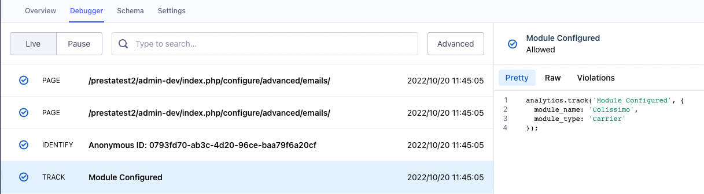

Tracking Plan are events forwarded to an application called **[Segment](https://segment.com/)**.
This events are used to track some user keys actions on prestashop.
For example, an event will be triggered if the user configure the _Colissimo_ module for the first time.

## Getting started

Tracking Plan is global to all Edition squads and not only for the SMB Edition squad.
We track events from the start to the end of the merchant journey.

In this documentation we will focus on all events concerning the **SMB Edition squad** on the prestashop Back Office.

:::info
The full event list is available [here](https://docs.google.com/spreadsheets/d/1heJYjivdNaw42szMeiMdZLE3N7DH_qIt2MQTcVJ0Oks/edit#gid=1476438640).
:::

### Event list

### How it works ?

## Trigger an existing event

## Create a new event
